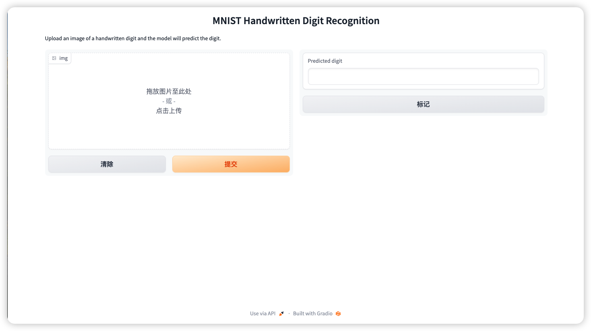

# 基于Gradio的手写数字识别-MLP部署

### 项目结构

```markdown
Mnist_Gradio
	checkpoint    --- 权重存放
	image		  --- 图片存放
	app.py		  --- 启动部署
	layers_1.py	  --- 多层感知机原生python实现、relu、sigmoid
	mnist_mlp_cpu --- 构建模型、训练、评估代码
```
### 寒武纪远程部署-基于Miniconda
假设您已经构建了自己的服务器，打开远程文件夹。打开终端输入以下命令即可安装Miniconda。

```
wget https://repo.anaconda.com/miniconda/Miniconda3-latest-Linux-x86_64.sh
sh Miniconda3-latest-Linux-x86_64.sh
```
安装好了之后按ctrl + shift + p,重新选择conda的解释器，也就是base环境。
### 安装相关依赖
```
pip install numpy
pip install gradio
pip install opencv-python
```
### 部署
在终端激活base的环境，或选择好解释器右键运行app.py。
```
conda activate base
python app.py
```
运行成功后，打开终端给的网址出现以下结果。

# Mnist_Gradio
